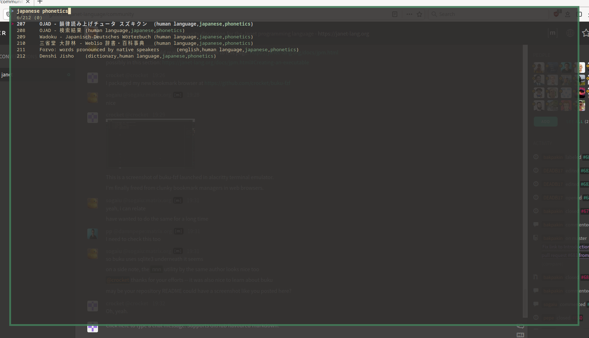

= buku-fzf

Choose buku bookmarks on fzf. Open them in browsers of your choice.
For details, read `buku-fzf --help`.

== Build

----
jpm build
jpm install
----

== Build-Time Dependencies

* https://janet-lang.org/[janet]
* https://github.com/janet-lang/argparse
* https://github.com/andrewchambers/janet-sh

== Runtime Dependencies

* setsid from util-linux
** `setsid -f` is used by buku-fzf
* https://github.com/jarun/buku[buku]
* https://github.com/junegunn/fzf[fzf]

== Screenshot

This is a screnshot of buku-fzf on a terminal emulator.
For convenience, you can map a keyboard shortcut to launching buku-fzf on
a terminal emulator.
